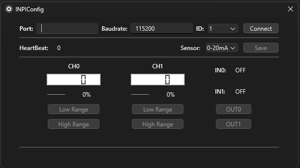

# INPI Config

Simple desktop application to configure main registers from INPI-CPU board by modbus RTU protocol.

## Screen



## Deploy

Following we will found the steps to deploy the application for Windows and Linux systems.

### Windows

Requirements:

- Python version >= 3.12
- InnpSetup version >= 5

First we need to create a virtual enviroment and install all the dependencies.

Creating  the virtual enviroment:

```
python -m venv venv       # create the venv
venv\Scripts\activate     # activate the ven
```

Installing the dependencies:

```
pip install -r requirements.txt
```

Then after created the virtual enviroment and install all needed dependencies, we can finally run the deploy script.

Running the deploy script:

```
deploy.bat
```

This will compile the python code and generate all binaries. We can find out the installer in **Output\INPIConfig.exe**.

### Linux (Debian based systems)

Requirements:

- Python version >= 3.12

First we need to create a virtual enviroment and install all the dependencies.

Creating  the virtual enviroment:

```
python3 -m venv venv       # create the venv
source venv/bin/activate   # activate the ven
```

Installing the dependencies:

```
pip install -r requirements.txt
```

Then after created the virtual enviroment and install all needed dependencies, we can finally run the deploy script.

Running the deploy script:

```
bash deploy.sh
```

This will compile the python code and generate all binaries. We can find out the installer **INPIConfig.deb** on the current path.

### Author
---

Create by Ailton Fidelix

[](https://www.linkedin.com/in/ailton-fidelix-9603b31b7/) 
